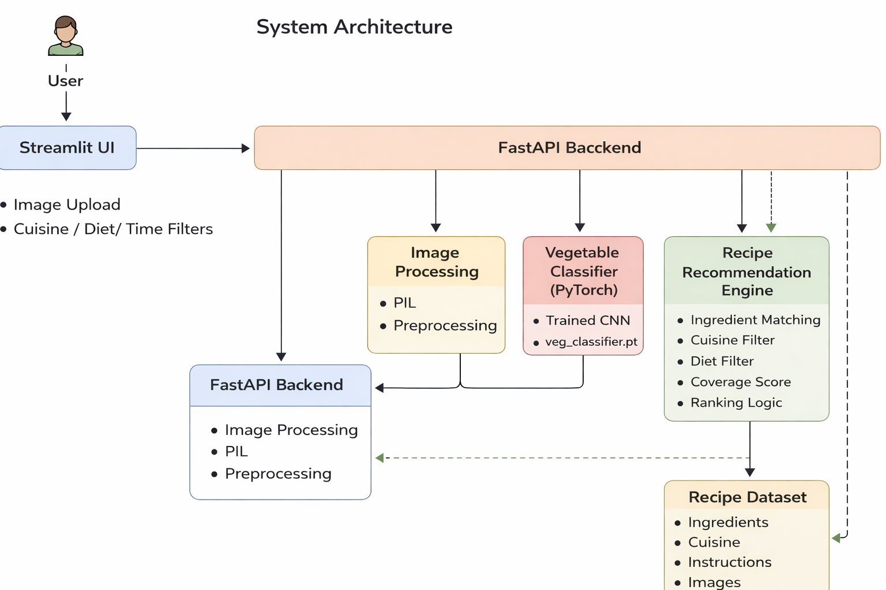

# 🍲 AI Recipe Recommender

An experimental AI-powered application that recommends cooking recipes based on
vegetables detected from an image, user preferences, and cuisine selection.

The goal of this project is to explore how computer vision, data processing, and
backend APIs can be combined to build a practical, user-centric recommendation system
using only open-source tools and datasets.

---

## 🚀 Key Features

- 📸 **Vegetable detection from image**
  - Uses a custom-trained image classifier
  - Detects vegetables from uploaded images

- 🧾 **Optional manual vegetable input**
  - Users can add vegetables they already have

- 🌍 **Dynamic cuisine selection**
  - Cuisine dropdown is populated directly from the dataset
  - Strict cuisine filtering (no cross-cuisine leakage)

- 🥕 **Ingredient awareness**
  - Clearly shows ingredients the user already has
  - Highlights missing ingredients required to cook each recipe

- 📊 **Ingredient coverage score**
  - Indicates how complete a recipe is with current ingredients

- 💡 **Smart ingredient suggestions**
  - Suggests additional ingredients to unlock more recipes

- ⏱️ **Preference-based filtering**
  - Cooking time
  - Meal type (Breakfast / Lunch / Dinner)
  - Vegetarian / Non-vegetarian option

---

## 🏗️ System Architecture

The following diagram illustrates the end-to-end architecture of the AI Recipe Recommender system, including image-based vegetable detection, recipe filtering, and ranking.

---

## 🛠️ Tech Stack

- **Python**
- **FastAPI** – backend REST API
- **Streamlit** – frontend UI
- **PyTorch** – vegetable image classifier
- **Pandas** – dataset processing
- **PIL / OpenCV** – image handling

All components are built using **open-source libraries**.

---

## ▶️ Running the Project Locally

Step 1: Clone the Repository

git clone https://github.com/RVs-Operation-Learn/ai-recipe-recommender.git
cd ai-recipe-recommender

Step 2: Create and Activate Virtual Environment
python -m venv .venv

Windows:
.venv\Scripts\activate

Linux / macOS
source .venv/bin/activate

Step 3: Install Dependencies
pip install -r requirements.txt

Step 4: Start the Backend (FastAPI)
python run.py

Backend runs at: 
http://127.0.0.1:8000

Step 5: Start the Frontend (Streamlit)
streamlit run frontend/streamlit_app.py

Frontend runs at:
http://localhost:8501

---

📝 Notes & Limitations

This project is experimental and built for learning purposes
Recipe images may not load for all recipes due to external website restrictions
Dataset quality directly affects recipe accuracy
The ranking logic is heuristic-based (not ML-ranked)

---

🤝 Contributions

This is a learning-focused project.
Feedback, suggestions, and improvements are welcome via issues or pull requests.

---

📄 License

This project uses publicly available datasets and open-source libraries.
Refer to individual datasets for their respective licenses.